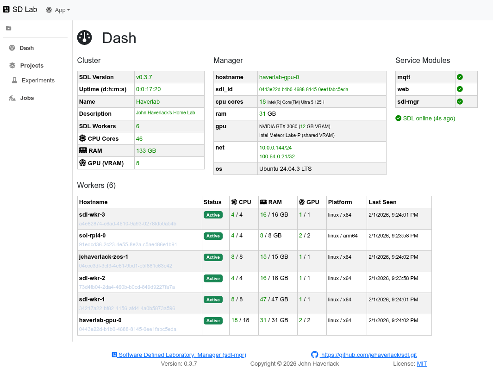
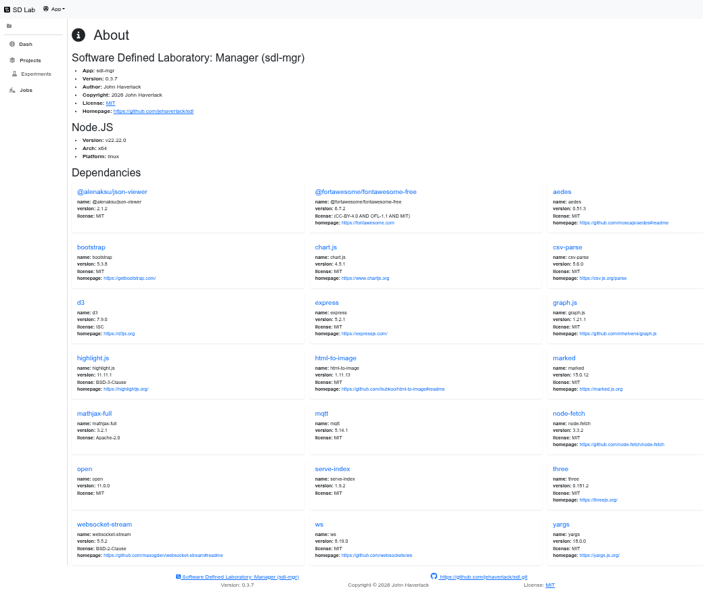

# Node Web App (NWA)

| Attribute | Value |
| --- | --- |
| **Author** | John Haverlack |
| **Copyright** | 2026 John Haverlack |
| **License** | MIT |
| **Version** | 0.1.2 |
| **Date** | 2026-07-17 |

## Overview

The Node Web App (NWA) project provides a Node.JS based Web Application Template for building Websites with serverside API and Web Front End.

## Design




For more information, see the [Design](docs/DESIGN.md) document.

## Getting Started

See also: [Installation](docs/INSTALL.md)

```
$ git clone https://github.com/jehaverlack/sdl.git
$ cd sdl
$ ./install-sdl.sh
```

Point your browser to http://IP-ADDR:8081

#### Firewall Rules

> NOTE: Firewall rules are required to allow SDL Workers to connect to your SDL Manager.

```
sudo ufw allow in proto tcp from <NETWORK CIDR> to any port 8081
sudo ufw allow in proto tcp from <NETWORK CIDR> to any port 1883
sudo ufw allow in proto tcp from <NETWORK CIDR> to any port 2883
sudo ufw allow in proto udp from <NETWORK CIDR> to any port 10101
```

## SDL Worker Installation

#### Discovery of the SDL Manager

Listen on UDP port 10101 for beacon messages broadcast by your SDL Manager. ```nc`'` is only used for discovery, once and SDL worker is running these sets.

```
nc -u -l -k 10101 | jq
```

Or to get the install command from the beacon message:

```
nc -u -l -k 10101 | jq -r '.msg.sdl_wkr_install_cmd[]'
```

**NOTE**: If you use UFW or a local firewall, you must allow SDL Worker to listen on UDP port 10101.

```
sudo ufw allow in proto udp from <NETWORK CIDR> to any port 10101
```

> **NOTE**: CTRL-C to exit `nc`.  You cannot run `nc` on port 10101 in parallel with the sdl-wkr.  So run it once to get the install command.  Then install sdl-wkr.

#### Installing a SDL Working Node

Run the **curl** or **wget** command provided by SDL Manager UDP beacon to install SDL Worker locally.

